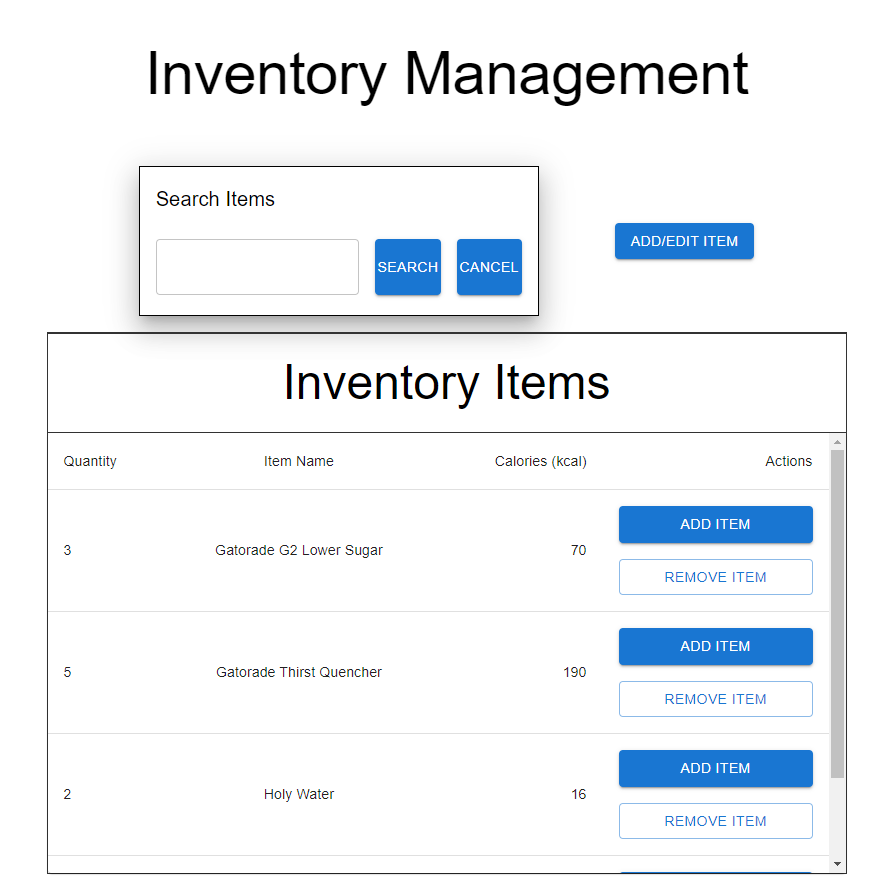
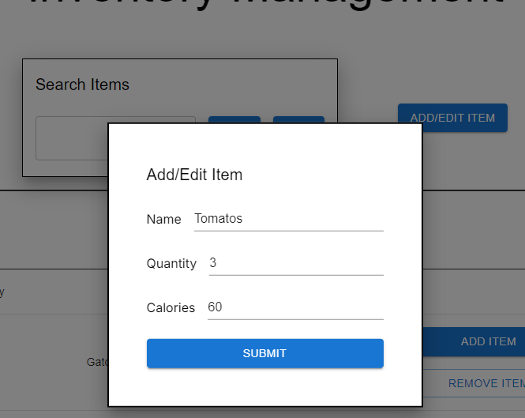
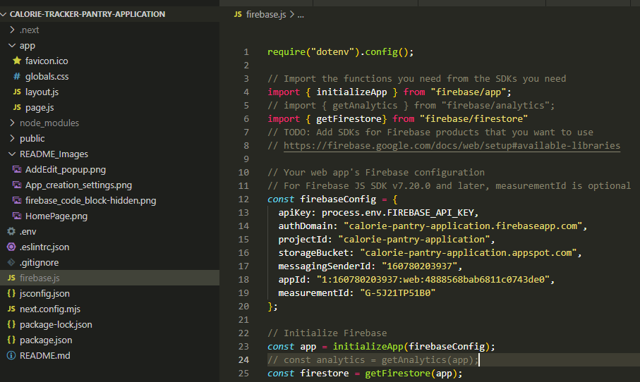

# Calorie-tracker-Pantry-Application
Project dedicated to learning Node, firebase, vercel, and image recognition.

Here I have created a Pantry Tracking application,
## Current features
- Adding new items with name, quantity and calories
- Editing existing items' quantity and calories
- Searching existing items
- Incrementing item after searching
- Decrementing item after searching (will delete if get down to 0)
- Adding/editing items will not accept calories and quantities less than 0 
- It will delete any existing items if the quantity is put as zero
- It wont create any items is quantity is less than 0
- Inventory items section will become scrollable when more than 3 items (making a screen look very clean and consise)

## Pages



## Next Steps
- Deplyment to Vercel and use CI/CD
- Capturing images using application
- Storing images in firebase

## Nice to haves
- Using Computer vision sources to be able to capture details of items such as nutritonal facts and quantities
- Add recipe suggestion feature based on pantry contents using OpenAI API or something similar 
- Using higher quality searching using algolia, minisearch or Elastic search


This is a [Next.js](https://nextjs.org/) project bootstrapped with [`create-next-app`](https://github.com/vercel/next.js/tree/canary/packages/create-next-app).

## Getting Started

First, run the development server:

```bash
npm run dev
```

Open [http://localhost:3000](http://localhost:3000) with your browser to see the result.


## Steps if the npm run dev fails (run at end)
1. Download Node.js
	1. Or check for it using node --version
2. Create project using command:
	1. npx create-next-app@latest
	2. 
3. Install [Material UI ](https://mui.com/material-ui/)and firebase (using npm install firebase)
4. Creating firebase app:
	1. Go to [firebase website](https://firebase.google.com/)> console on top right
	2. Create app
	3. default settings
	4. Create firebase.js file at base and paste the code block given 
	5. 
5. Now in the firebase console click on build>Firestore Database > create database
	1. leave the name
	2. MAKE IT IN test mode